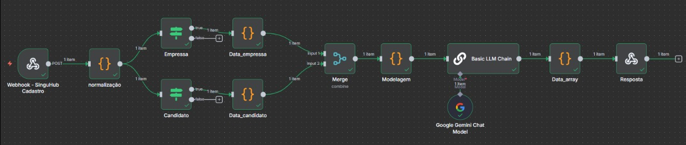

# 🚀 SinguHub Dev API

API desenvolvida em **NestJS** para integração entre **Stripe Checkout** e **Blockchain Ethereum** (via Ganache).  
O projeto permite criar sessões de pagamento, salvar certificados em blockchain e consultar certificados armazenados.

---

## 🧩 Tecnologias Principais

- **NestJS 11** — Framework Node.js modular e escalável  
- **Ethers.js** — Conexão e interação com contratos Solidity  
- **Solidity 0.8.x** — Linguagem para contratos inteligentes  
- **Ganache** — Blockchain local para testes  
- **Stripe API** — Geração de sessões de checkout  
- **Hardhat** — Build, teste e deploy dos contratos  
- **TypeScript** — Tipagem estática e segurança no desenvolvimento  

---

## 📁 Estrutura do Projeto

```
.
├── src/
│   ├── app.module.ts
│   ├── app.controller.ts
│   ├── blockchain/
│   │   ├── blockchain.controller.ts
│   │   ├── blockchain.service.ts
│   │   └── blockchain.dto.ts
│   └── package/
│       └── package.module.ts
├── contract.sol
├── buildContract.js
├── .env
├── package.json
├── tsconfig.json
└── nest-cli.json
```

---

## ⚙️ Configuração do Ambiente

### 1️⃣ Pré-requisitos

- Node.js 18+
- NPM ou Yarn
- Ganache (GUI ou CLI)
- Conta Stripe com chave `SECRET_KEY`
- Hardhat instalado globalmente (`npm install -g hardhat`)

---

### 2️⃣ Clonar e instalar dependências

```bash
git clone https://github.com/seuusuario/singuhub-dev-api.git
cd singuhub-dev-api/test
npm install
```

---

### 3️⃣ Configurar variáveis de ambiente

Crie o arquivo `.env` na raiz do projeto com:

```env
STRIPE_SECRET_KEY=sk_test_sua_chave_aqui
GANACHE_RPC_URL=http://127.0.0.1:7545
PRIVATE_KEY=0xSEU_PRIVATE_KEY_GANACHE
CONTRACT_ADDRESS=0xEnderecoContratoDepoisDoDeploy
```

---

## 🧠 Blockchain (Solidity + Hardhat + Ganache)

### 1️⃣ Compilar o contrato

O contrato está no arquivo `contract.sol`.

Para compilar manualmente:

```bash
npx hardhat compile
```

Ou via script `buildContract.js` (compila com `solc` e gera `contractData.json`):

```bash
node buildContract.js
```

---

### 2️⃣ Iniciar o Ganache

Abra o Ganache (GUI) ou CLI:

```bash
ganache --port 7545
```

Anote:
- O endereço RPC (ex: `http://127.0.0.1:7545`)
- Uma chave privada de uma conta

---

### 3️⃣ Fazer o Deploy do Contrato

Crie um script `deploy.js` (caso não exista) com:

```js
const { ethers } = require("ethers");
const fs = require("fs");
const contractData = require("./contractData.json");

const provider = new ethers.JsonRpcProvider(process.env.GANACHE_RPC_URL);
const wallet = new ethers.Wallet(process.env.PRIVATE_KEY, provider);

(async () => {
  const factory = new ethers.ContractFactory(contractData.abi, contractData.bytecode, wallet);
  const contract = await factory.deploy();
  await contract.waitForDeployment();
  console.log("Contrato implantado em:", await contract.getAddress());
})();
```

Executar:
```bash
node deploy.js
```

Salve o endereço exibido em `.env` → `CONTRACT_ADDRESS`.

---

## 💳 Integração com Stripe

### 1️⃣ Criar sessão de checkout

**Rota:** `POST /checkout`

**Exemplo de requisição:**
```json
{
  "priceId": "price_123456789",
  "successUrl": "http://localhost:3000/success",
  "cancelUrl": "http://localhost:3000/cancel"
}
```

**Resposta:**
```json
{
  "url": "https://checkout.stripe.com/pay/cs_test_..."
}
```

---

## 🔗 Rotas Blockchain

### 🪪 Salvar certificado

**Rota:** `POST /blockchain/certificate`

**Body:**
```json
{
  "id": "1234",
  "owner": "Joabe Borges",
  "data": "Certificado concluído em 2025-10-25"
}
```

**Retorno:**
```json
{
  "transactionHash": "0xabc123..."
}
```

---

### 🔍 Buscar certificado

**Rota:** `GET /blockchain/certificate/:id`

**Resposta:**
```json
{
  "id": "1234",
  "owner": "Joabe Borges",
  "data": "Certificado concluído em 2025-10-25"
}
```

---

## 🧪 Executar a Aplicação

### Ambiente de desenvolvimento

```bash
npm run start:dev
```

A API ficará disponível em:

```
http://localhost:3000
```

---

### Build de produção

```bash
npm run build
npm run start:prod
```

---

## 🖼️ Prints e Demonstrações

### 💻 Tela de Checkout Stripe

### 🧾 Certificado registrado na Blockchain

---

## 🧱 Estrutura Modular (NestJS)

| Módulo | Descrição |
|--------|------------|
| `AppModule` | Módulo raiz que carrega os demais |
| `BlockchainModule` | Lida com operações no contrato Solidity |
| `PackageModule` | Integração com Stripe e controle de checkout |

---

## 🧰 Scripts úteis

| Comando | Descrição |
|----------|------------|
| `npm run start:dev` | Inicia o servidor em modo watch |
| `npm run build` | Compila o projeto |
| `npm run start:prod` | Executa a versão buildada |
| `node buildContract.js` | Compila o contrato Solidity |
| `node deploy.js` | Realiza o deploy no Ganache |
| `npm run lint` | Corrige formatação automática |
| `npm run test` | Executa testes unitários (Jest) |

---

## 🛡️ Boas Práticas

- Sempre utilize uma nova conta no Ganache para testes.
- Nunca compartilhe a `PRIVATE_KEY` publicamente.
- Teste o checkout com a [chave de teste da Stripe](https://stripe.com/docs/testing).

---

## 🧑‍💻 Autor

**Joabe Borges**  
Desenvolvedor Full Stack / Blockchain  
📧 contato: [joabe.conrado19@gmail.com]()

---


## 📂 Consultas de certificados Singuhub na blockchain


---

🟢 **Tudo pronto!**  
Agora você tem um backend NestJS integrado com Stripe e blockchain Ethereum rodando localmente com Ganache, e em produção validar hash de certificados com etherscan 🚀

# Documentação do Workflow n8n: SinguHub Cadastro

Este documento descreve o funcionamento do workflow n8n para o cadastro e análise de compatibilidade entre candidatos e vagas no sistema SinguHub.

---

## Visão Geral

O workflow recebe dados via webhook (POST) na rota /singuhub-cadastro, contendo informações sobre uma empresa e um candidato. Após validações, os dados são extraídos, normalizados e processados para cálculo de compatibilidade técnica, comportamental, cultural e geográfica. O resultado é formatado e enviado como resposta.

---



## Nodes e Funções

### 1. Webhook - SinguHub Cadastro  
- Tipo: Webhook  
- Método HTTP: POST  
- Caminho: /singuhub-cadastro  
- Função: Recebe o payload inicial com dados da empresa e candidato.

### 2. normalização  
- Tipo: Code  
- Função: Adiciona um campo auxiliar (myNewField) para normalização inicial dos dados recebidos.

### 3. Empressa (If)  
- Tipo: If  
- Condição: Verifica se o campo empresa_nome está presente e não vazio no JSON recebido.  
- Fluxo: Se verdadeiro, segue para extração dos dados da empresa.

### 4. Candidato (If)  
- Tipo: If  
- Condição: Verifica se o campo candidato.nome está presente e não vazio no JSON recebido.  
- Fluxo: Se verdadeiro, segue para extração dos dados do candidato.

### 5. Data_empressa  
- Tipo: Code  
- Função: Extrai os dados da empresa do JSON recebido no webhook. Caso não encontre, retorna erro.

### 6. Data_candidato  
- Tipo: Code  
- Função: Extrai os dados do candidato do JSON recebido no webhook. Caso não encontre, retorna erro.

### 7. Merge  
- Tipo: Merge (combineByPosition)  
- Função: Combina os dados extraídos da empresa e do candidato em um único fluxo para processamento.

### 8. Modelagem  
- Tipo: Code  
- Função:  
  - Separa os dados da empresa e do candidato para cálculo.  
  - Calcula a compatibilidade técnica (40%), comportamental (20%), fit cultural (30%) e localização (10%).  
  - Utiliza dados como requisitos técnicos, competências comportamentais, perfil cultural (Big Five) e distância geográfica entre empresa e candidato.  
  - Retorna um objeto com o score total, detalhamento por categoria e status de compatibilidade (Alta, Média, Baixa).

### 9. Code in JavaScript  
- Tipo: Code  
- Função: Organiza os dados de saída para enviar para o modelo LLM e resposta final.

### 10. Basic LLM Chain1  
- Tipo: Langchain LLM Chain  
- Função: Envia os dados para um modelo de linguagem (Google Gemini) para gerar feedback estruturado e empático para candidato e empresa, baseado nas regras definidas.

### 11. Google Gemini Chat Model1  
- Tipo: Modelo de IA Google Gemini  
- Função: Processa a requisição do LLM Chain para análise de compatibilidade e geração de feedback.

### 12. Data_array  
- Tipo: Code  
- Função: Limpa e formata o retorno do modelo LLM para JSON puro e estruturado.

### 13. Resposta  
- Tipo: Respond to Webhook  
- Função: Envia a resposta final do workflow ao solicitante HTTP.

---

## Fluxo de Dados

1. O webhook recebe os dados JSON com empresa e candidato.  
2. Os nodes Empressa e Candidato validam presença dos dados essenciais.  
3. Data_empressa e Data_candidato extraem dados específicos para processamento.  
4. Merge junta as informações para análise conjunta.  
5. Modelagem calcula scores de compatibilidade e gera o resultado detalhado.  
6. O resultado é enviado para o modelo LLM para elaboração de feedback humano e estruturado.  
7. A resposta final é formatada e enviada pelo node Resposta.

---

## Observações Técnicas

- Compatibilidade técnica avaliada comparando habilidades do candidato com requisitos da vaga.  
- Compatibilidade comportamental considera competências comportamentais desejadas.  
- Fit cultural avalia similaridade no modelo Big Five entre candidato e vaga.  
- Distância geográfica é calculada usando coordenadas GPS e aplicada penalização por raio máximo permitido.  
- Pontuação final ponderada e classificada em três níveis: Alta (≥70%), Média (40–69%), Baixa (<40%).  
- Feedbacks para candidato e empresa seguem formato JSON estrito, sem texto adicional.

---

## Referências

- Curso sugerido para desenvolvimento: https://singuacademy.com/curso  
- Modelo de linguagem Google Gemini para geração de feedback.
